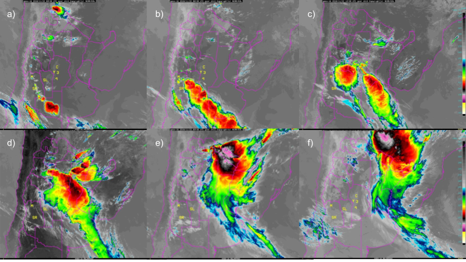

<!--
This is for including Chapter 1.  Notice that it's also good practice to name your chunk.  This will help you debug potential issues as you knit.  The chunk above is called intro and the one below is called chapter1.  Feel free to change the name of the Rmd file as you wish, but don't forget to change it here from chap1.Rmd.
-->

<!--
The {#rmd-basics} text after the chapter declaration will allow us to link throughout the document back to the beginning of Chapter 1.  These labels will automatically be generated (if not specified) by changing the spaces to hyphens and capital letters to lowercase.  Look for the reference to this label at the beginning of Chapter 2.
-->

# Metodología {#metodologia}

## El sistema de asimilación GSI

GSI y CRTM

## Caso de estudio

El 22 de noviembre de 2018 un frente frío cruzó la región centro de Argentina generando el desarrollo de celdas convectivas aisladas que crecieron rápidamente hasta convertirse en un SCM excepcionalmente grande. Al norte de la región, un frente cálido contribuyó al desarrollo de sistemas multicelulares que finalmente crecieron y se fusionaron con el SCM. 
El SCM recorrió aproximadamente 2500 km de sur a norte, disipándose sobre Paraguay y el sur de Brasil al cabo de 42 horas. 

(ref:caso-goes16) Serie de imagenes del canal 13 (10.3 mu) del satelite GOES-16 para las a) 00 UTC, b) 06 UTC, c) 12 UTC, d) 18 UTC del 22 de noviembre de 2018 y e) 00 UTC y f) 06 UTC del 23 de novimebre de 2018.

```{r caso-goes16, fig.cap="(ref:caso-goes16)", fig.width=7, fig.align='center', out.width="100%"}

```


## Configuración del ensamble

Las simulaciones numéricas para el caso de estudio se realizan utilizando la versión 3.9.1 de modelo WRF (@skamarock2008). 
Se utilizó una resolución horizontal de 10 km (150 x 200 puntos de retícula) y 37 niveles en la vertical con el tope del modelo en 50 hPa. 
Las condiciones iniciales y de contorno surgen del análisis del Global Forecast System (GFS) (resolución horizontal de 0,25$^{circ}$ y resolución temporal de 6 horas; @cisl_rda_ds084.1). 
El dominio cubre la zona indicada en la Figura \ref(fig:dominio) para capturar el desarrollo del SCM durante el periodo simulado. 

Los análisis se generaron utilizando la implementación LETKF (V1.3, @hunt2007) que forma parte del sistema de análisis Gridpoint Statistical Interpolation (GSI V3.8; @shao2016). 
Se utilizó un enfoque de actualización rápida con análisis horario y una ventana de asimilación centrada, lo que significa que se asimilaron todas las observaciones dentro de $\pm$ 30 minutos del tiempo de análisis. 
Además, aas observaciones se asimilaron usando un enfoque 4D, es decir, comparándolas con el first guess más cercano que se genera en intervalos de 10 minutos. 
Para las observaciones de satelite, se utilizó el Community Radiative Transfer Model versión 2.3 (CRTM; @han2006) como operador de observaciones para calcular las temperaturas de brillo simuladas por el modelo. 

Utilizamos un conjunto de 60 miembros, cuya media al principio del ciclo de AD se inicializa utilizando el análisis deterministico del GFS al que se le suman perturbaciones aleatorias para generar el ensamble incial. Las perturbaciones se generaron como diferencias escaladas entre dos estados atmosféricos aleatorios obtenidos a partir de los datos del Reanálisis del Sistema de Predicción del Clima (CFSR) con una resolución horizontal de 0,5$^{circ}$ que tiene una con una evolución temporal suave [@necker2020; @maldonado2021]. De este modo, preservamos el equilibrio casi hidrostático y geostrófico de las escalas mayores. Este método ayuda a evitar una subestimación del spread del ensamble [@ouaraini2015]. Las perturbaciones  también se aplicaron en los límites para mantener niveles adecuados de spread dentro del dominio del ensamble. 

Además de las perturbaciones aleatorias en los límites laterales, se utilizó un esquema de multifísicas para representar mejor la incertidumbre en el modelo dentro del sistema de AD. Utilizamos 9 configuraciones diferentes que consisten en la combinación de 3 esquemas de convección húmeda (Kain-Fritsch [@kain2004], Grell-Freitas [@grell2013], y Betts-Miller-Janjic [@janjic1994]) y 3 esquemas de capa límite planetaria (Esquema de la Universidad de Yonsei [@hong2006], Esquema Mellor-Yamada-Janjic [@janjic1994], y Mellor-Yamada Nakanishi Niino [@nakanishi2009]). Todos los miembros del conjunto utilizan las mismas parametrizaciones del modelo de superficie terrestre (Noah-MP, @chen2001), de microfísica (esquema de un solo momento de 6 clases del WRF [@hong2006a]) y de procesos radiativos (esquema de onda corta y onda larga del RRTMG [@iacono2008]).

Para reducir el efecto de las correlaciones espurias en la estimación de las covarianzas de los errores de las observaciones, utilizamos un radio de localización horizontal de 180 km y un radio de localización vertical de 0,4 (en coordenadas de presión logarítmica) como en @dillon2021 para todos los tipos de observaciones. 
Se aplicó con un parámetro de inflación $\alpha=0,9$ para mitigar el impacto de los errores de muestreo y para considerar los errores del modelo que no se tienen en cuenta en el enfoque mutifísica del ensamble [@whitaker2012].

(ref:dominio) a) Dominio utilizado para las simulaciones (recuadro negro), dominio interior utilizado para la comparación entre experimentos (recuadro rojo), la región mostrada en b) (recuadro azul claro), y la ubicación de las Estaciones Meteorológicas Automáticas (EMA, cuadrados verdes) y las Estaciones Meteorológicas Convencionales (EMC, triángulos naranjas). b) Ubicación de los lanzamientos de radiosondeos durante RELAMPAGO. Los puntos verdes corresponden a los radiosondeos lanzados durante el IOP 7, los triángulos naranjas son radiosondeos lanzados durante el IOP 8, y los cuadrados morados son radiosondeos lanzados fuera de los periodos de medición intensiva. También se muestra la topografía en metros (sombreada).

```{r dominio, fig.cap="(ref:dominio)", out.width="80%", fig.align='center'}

oficiales <- fread(here("data/derived_data/sample_obs/E2_asim_conv_20181121120000.ensmean"), 
                   na.strings = c("0.100E+11", "-0.100E+06", "-99999.90", "-100000.00")) %>% 
  .[, c("V2", "V4") := NULL] %>% 
  setnames(colnames(.), c("var", "stationID", "type", "dhr", "lat", "lon", "pressure", "usage.flag", "flag", "obs", "obs.guess", "obs2", "obs.guess2", "rerr")) %>% 
  .[type %in% c(181, 281)] %>% unique(by = c("stationID")) %>%
  .[!str_detect(stationID, pattern = "[A-Z]")] %>% 
  .[, source := "Sfc - Official"]

no_oficiales <- fread(here("data/derived_data/sample_obs/E5_asim_conv_20181121120000.ensmean"), 
                      na.strings = c("0.100E+11", "-0.100E+06", "-99999.90", "-100000.00")) %>% 
  .[, c("V2", "V4") := NULL] %>% 
  setnames(colnames(.), c("var", "stationID", "type", "dhr", "lat", "lon", "pressure", "usage.flag", "flag", "obs", "obs.guess", "obs2", "obs.guess2", "rerr")) %>% 
  .[type %in% c(181, 187)] %>% 
  .[!str_detect(stationID, "SMN")] %>%
  .[!str_detect(stationID, "^SC")] %>%
  .[!(stationID %in% oficiales$stationID)] %>% 
  unique(by = c("stationID")) %>% 
  .[, source := "Sfc - Non-official"]

obs <- rbind(no_oficiales, oficiales)

lista_sondeos <- fread(here("data/derived_data/sample_obs/lista_sondeos.csv")) %>% 
  .[, periodo := fcase(nominal_launch_time %between% c(ymd_hms("20181121150000"), ymd_hms("20181121210000")),  "IOP 7", 
                       nominal_launch_time %between% c(ymd_hms("20181122140000"), ymd_hms("20181122200000")),  "IOP 8", 
                       default = "Otros")
  ]

dominio <- fread(here("data/derived_data/sample_obs/dominio_hgt.csv")) %>% 
  .[, c("x", "y") := wrf_project(lon, lat)]

g1 <- dominio %>% 
  ggplot(aes(x, y)) +
  geom_contour_fill(aes(z = hgt), proj = norargentina_lambert,
                    breaks = seq(0, 6000, 500)) +
  scale_fill_gradient(low = "#f2f2f2", high = "#333333",
                      name = NULL,
                      breaks = seq(0, 6000, 1000),
                      guide = NULL) +
  geom_mapa() +
  geom_point(data = obs, aes(ConvertLongitude(lon), lat, 
                             color = source, shape = source), 
             size = 1, alpha = 0.8) + 
  geom_rect(aes(xmin = -66.5, xmax = -61.5, ymin = -35.5, ymax = -29), 
            color = "#40BDEC", alpha = 0) +
  scale_shape_manual(name = NULL,  
                     breaks = c("Sfc - Non-official", "Sfc - Official"),
                     labels = c("EMA","EMC"), values = c(15, 17),
                     guide = guide_legend(override.aes = list(size = 2))) +
  scale_color_manual(name =  NULL, 
                     values = c("Sfc - Non-official" = "#00695c", 
                                "Sfc - Official" = "#FD8002"),
                     breaks = c("Sfc - Non-official", "Sfc - Official"),
                     labels = c("EMA","EMC"),
                     guide = guide_legend(override.aes = list(size = 2))) +
  geom_point(data = square, aes(lon, lat), size = 0.2) +
  geom_point(data = square2, aes(lon, lat), size = 0.2, color = "#CC3311") +
  theme_minimal(base_size = 10) +
  theme(legend.box = "horizontal",
        legend.position = c(0.1, 0.95),
        legend.background = element_rect(fill = "white", color = "white")) 


temp <- dominio %>% 
  ggplot(aes(x, y)) +
  geom_contour_fill(aes(z = hgt), proj = norargentina_lambert,
                    breaks = seq(0, 6000, 500)) +
  scale_fill_gradient(low = "#f2f2f2", high = "#333333",
                      name = "Altura (m)",
                      breaks = seq(0, 6000, 1000),
                      guide = guide_colorstrip(barwidth = 20,
                                               barheight = 0.5)) +
  geom_mapa() +
  coord_sf(ylim = c(-35.5, -29), xlim = c(-66.5, -61.5)) +
  theme_minimal(base_size = 11) +
  theme(legend.position = "bottom") 

legend <- get_legend(temp)

g2 <- dominio %>% 
  ggplot(aes(x, y)) +
  geom_contour_fill(aes(z = hgt), proj = norargentina_lambert,
                    breaks = seq(0, 6000, 500)) +
  scale_fill_gradient(low = "#f2f2f2", high = "#333333",
                      name = NULL,
                      breaks = seq(0, 6000, 1000),
                      guide = NULL) +
  geom_mapa() +
  coord_sf(ylim = c(-35.5, -29), xlim = c(-66.5, -61.5)) +
  geom_jitter(data = lista_sondeos, aes(lon, lat, 
                                        color = periodo,
                                        shape = periodo), 
              alpha = 0.5, size = 1.5, width = 0.03, height = 0.03) +
  scale_color_brewer(palette = "Dark2",
                     guide = guide_legend(override.aes = list(size = 2,
                                                              alpha = 1))) +
  labs(color = NULL, shape = NULL) +
  theme_minimal(base_size = 11) +
  theme(legend.box = "horizontal",
        legend.position = c(0.16, 0.92),
        legend.background = element_rect(fill = "white", color = "white")) 

ggdraw(plot_grid(plot_grid(g1, g2, ncol = 2, rel_widths = c(1, 0.5), 
                           labels = c("a)", "b)"), label_size = 11), legend, 
                 ncol = 1, rel_heights = c(1, 0.08)))
```

## Verificación: obs y metricas
